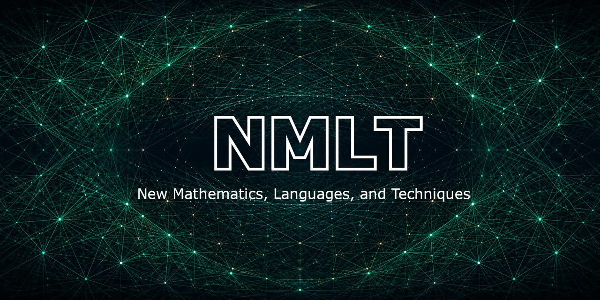

# NMLT



[](https://github.com/agentcarlosian/NMLT/actions/workflows/ci.yml)

**NMLT — New Mathematics, Languages, and Techniques — is a research repository
for trustworthy computation.** It investigates candidate mathematical
foundations and tests evidence-directed techniques. Its flagship project is the
**NMLT language**, designed as a behavior-first, evidence-carrying programming
language.

> To truly progress, humanity needs new mathematics, new languages, and new
> techniques.

NMLT is pre-alpha research software. It is not intended to authorize
safety-critical, financial, security-critical, or irreversible actions.

## NMLT today

The active work develops the language and its mathematics together. The current
finite core covers observations, typed boundary actions, affine authority,
resource grades, and rely/guarantee contracts for binary composition.

Rust implements the lossless frontend, typed elaboration pipeline, canonical
artifact producer, and a reference explorer. Lean defines the current
behavioral semantics, checks the theorem premises, and is the semantic authority
for the current behavioral core.

The [getting-started guide](docs/getting-started.md) walks through the finite
sender/receiver fixture, its refinement, canonical artifact, Lean validation,
and non-authoritative exploration.

## From source to semantics

```text
exact .nmlt bytes
  → lossless syntax, resolution, and typed elaboration       Rust
  → deterministic behavior-core-v1 artifact                 Rust
  → finite behavior construction and premise checking       Lean
  → conditional composition/refinement witnesses            Lean
  → bounded operational inspection, assurance: none         Rust
```

| Area | Current status |
|---|---|
| Language | Finite state, observations, typed ports, affine capabilities, grades, rely/guarantee facts, binary wiring, and explicit state maps |
| Semantics | Lean defines resource-bearing behavior and conditional composition/refinement; a separate authority-world layer tracks unique one-step ownership changes without claiming reachability or equivalence between the layers |
| Artifact | Canonical `behavior-core-v1` JSON carries typed terms, action profiles, wiring, refinement data, and a source digest |
| Exploration | `nmlt-eval` explores finite artifacts for language design and debugging, always with `assurance: none` |

This milestone is finite, binary, and safety-oriented. The source digest
identifies the source bytes presented to Lean; the repository separately
reproduces and byte-compares the primary artifact. Detailed semantic boundaries
are recorded with the active definitions in the
[current calculus](docs/core-calculus.md).

Implementation and semantic claim boundaries are documented in the
[architecture](docs/architecture.md), [security policy](SECURITY.md),
[trusted-component inventory](security/trusted-components.toml), and
[Lean axiom inventory](mechanization/lean/AXIOMS.md).

## Research map

- [Getting started](docs/getting-started.md)
- [Language sketch](docs/language-sketch.md)
- [Architecture](docs/architecture.md)
- [Project status and roadmap](docs/roadmap.md)
- [Manifesto](docs/manifesto.md)
- [Contributing](CONTRIBUTING.md)

See also the [project history](docs/history.md), [security policy](SECURITY.md),
and [citation metadata](CITATION.cff).

NMLT is licensed under Apache-2.0. See [`LICENSE`](LICENSE).
