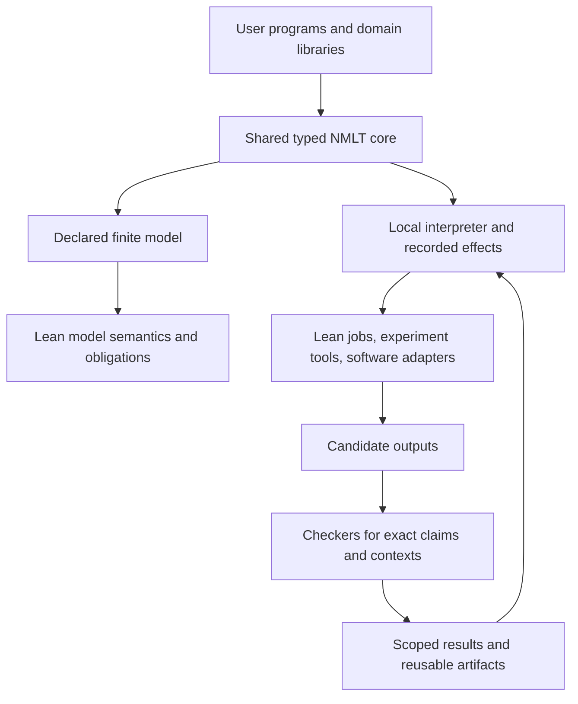

# Making NMLT practical: research and proposed direction

Date: 2026-09-06. Audience: Ian and NMLT maintainers. Status: researched proposal, not an accepted language change or a report of implemented features.

This review combines the current repository, three independent research lanes, the local research archive, and primary external sources. The objective is one useful language serving AI/Lean developers, mathematicians, and software engineers. The companion [execution plan](../../docs/practical-language-plan.md) defines dependencies, owners, demonstrations, and acceptance gates.

## Recommendation

Develop NMLT into an executable language for computations with explicit behavior, resources, and checkable claims. Make proof development, conjecture experiments, and finite software protocols three applications of the same core. Keep mathematical definitions and proofs in native Lean, and use ordinary Rust/Python tools through small typed adapters.

The proposed advantage is compositional reasoning about the workflow itself: which actions are permitted, which resource can be used next, what an external result establishes, and what evidence is needed before another step may rely on it. This advantage is a hypothesis. It needs to beat straightforward programs built with existing tools on practical tasks.

A first useful program should receive an input, perform real local work, handle failure, produce a reusable output, and explain its checks. A specialized language can meet that standard without first acquiring the breadth of a general-purpose application ecosystem. Its first release still needs modules, useful values, control flow, effects, diagnostics, installation, and libraries.

## What the Fermat news actually establishes

On September 4, 2026, Anthropic announced a complete Lean formalization of Fermat's Last Theorem. It reports an 11-day campaign using many agents and roughly six billion output tokens. That is substantial formalization progress, with substantial compute behind it. [Anthropic announcement](https://www.anthropic.com/research/formalizing-fermats-last-theorem)

Kevin Buzzard independently reports compiling the code and running Comparator successfully. He explains that the work follows an older exposition of the established proof; his own goals of reusable library contributions and a human-explorable modern proof remain relevant. The announcement therefore supports the feasibility of large formalization, while leaving a clear need for maintainable, intelligible mathematical software. [Buzzard, 2026-09-04](https://xenaproject.wordpress.com/2026/09/04/flt-anthropic-has-beaten-me-to-it/)

The released repository documents target-statement comparison, transitive axiom checking, and an independent NanoDA run. It also describes a large, costly-to-check research artifact that is not maintained as a contribution-oriented library. I inspected these reports, not a local rebuild of the full proof. [Released artifact and verification record](https://github.com/anthropics/fermats-last-theorem)

The useful architectural lesson is the importance of durable shared state. Anthropic reports early coordination failures, then improvement from a theorem dependency graph, separation of statements from proofs, and searchable reusable lemmas. NMLT should measure the benefit of those mechanisms on small local projects rather than extrapolate the campaign's scale to a small team.

## What already exists and what that changes

| Existing work | Supported observation | Implication for NMLT |
|---|---|---|
| [Lean runtime](https://lean-lang.org/doc/reference/latest/Run-Time-Code/) | Lean itself has a programming runtime and foreign-function support | Use native Lean as a serious implementation baseline; new mathematical syntax needs a demonstrated reason |
| [LeanInteract](https://github.com/augustepoiroux/LeanInteract) | MIT-licensed Python interface to Lean REPL, project handling, diagnostics, and incremental interaction | Try a replaceable adapter; verify version compatibility instead of assuming support for the patched checker |
| [Numina-Lean-Agent, 2026](https://arxiv.org/html/2601.14027v1) | Integrates a coding agent, Lean interaction, retrieval, reasoning tools, and evolving proof plans | Basic agent integration is already available; compare maintainability and user effort against it |
| [Prove2Me, 2026](https://arxiv.org/html/2608.28433) | Organizes collaborative formalization around exact statements, separate proofs, audited missions, and reusable dependencies | A proof graph, statement locking, and multiple agents are baseline capabilities, not NMLT novelty claims |
| [Quint model-based testing](https://quint.sh/docs/model-based-testing) | Connects executable specifications and generated traces to implementation tests | Engineers need a model-to-program feedback loop; use this as a usability and integration baseline |
| [P](https://p-org.github.io/P/) | Documents specification checking, runtime observation, and AI-assisted tooling | “AI plus formal methods” already describes an existing category; NMLT needs a more specific benefit |
| [CausalSmith, 2026](https://arxiv.org/html/2607.22511v3) | Combines a domain library, conjecture/proof workflow, statement auditing, and library growth | Discovery needs a good domain library and explicit review, not only a generic agent loop |

Numina's paper discusses verbose proofs, difficult type conversions, and abstraction/readability problems. These suggest useful measurements: whether a maintainer understands the result, whether a patch survives a dependency update, and whether a subsequent proof can reuse it. Benchmark theorem counts alone miss that work.

Prove2Me already addresses several coordination problems that could otherwise look like new NMLT ideas. The research did not establish that all of its infrastructure is available as a reusable, appropriately licensed local dependency; implementation must verify that before adopting code. A documented mechanism can inform design without becoming a dependency.

CausalSmith is particularly useful counterevidence to overconfidence. Its limitations acknowledge fallible LLM statement review, no independent human validation of its novelty ratings, and incomplete cost measurements. A proof accepted by Lean, a faithful interpretation of an informal claim, and a useful research contribution are separate judgments.

## The repository gap is practical as well as mathematical

The current repository supplies lossless syntax, canonical artifacts, explicit resource/composition structure, Lean-defined semantics, and disciplined validation. It also exposes the key remaining gaps in [its architecture](../../docs/architecture.md): separate static/dynamic layers, incomplete open-interface preservation, no decoded dynamic initial execution witness, and no reusable received authority across later actions.

Source inspection adds practical constraints. The [behavioral compiler](../../crates/nmlt-compile/src/behavior.rs) follows a different route from the retained ordinary HIR/elaboration/kernel pipeline. Behavioral expressions are small; the [explorer](../../crates/nmlt-eval/src/lib.rs) uses Boolean state. The [CLI](../../crates/nmlt-cli/src/main.rs) has no general input-to-output program runner or host effect interface. The behavioral diagnostic structure also needs source locations before it can support a good editor experience.

These findings argue for shared frontend facilities, a reusable step interpreter, useful data and modules, and typed external effects. Adding more theorem declarations alone will not make these missing language operations available.

There is also an immediate checker maintenance issue: the local [Lean pin](../../mechanization/lean/lean-toolchain) is 4.30.0. Upstream's August postmortem reports fixes in 4.33.1 and notes that some external checkers were affected too. Upgrade and freshly recheck the compatible toolchain; this is not evidence that NMLT's existing theorems are false. [Lean FRO chief architect's postmortem](https://leodemoura.github.io/blog/2026-8-24-postmortem-for-the-kernel-soundness-bug-hunt/)

## A shared architecture for the three audiences

This is a proposed design. The diagram does not imply a proved correspondence between every external execution and its finite model. Each abstraction, adapter, and compiler boundary must have its own stated evidence and assumptions.

**Language core.** Programs use typed inputs and outputs, records and sum types, pattern matching, modules, reusable components, bounded iteration, and explicit effects. Large Lean terms, source files, datasets, and tool results travel as typed artifact references. A finite abstraction decides which facts about them become model state; an opaque handle does not make its full contents finite or verified.

Each new construct needs an explicit Lean interpretation/validation path or an executable-only designation. A simulation/admissibility obligation, or a clearly stated trusted assumption, must connect an abstraction to concrete execution before its properties can transfer. The first property feature should carry a user's actual safety invariant through the artifact into initialization and preservation obligations.

**Execution.** Use one local interpreter and a small job protocol before building a distributed runtime. Specify success, failure, timeout, cancellation, stale results, and recovery. Recorded effects support replay and debugging. An external action whose completion is uncertain must remain uncertain; local state cannot manufacture exactly-once behavior across a crashed host.

Use a fixed slot pool with bounded attempts initially. Results must bind to an attempt generation and its inputs, so delayed work cannot be mistaken for a new occupant of a recycled slot. This makes job identity a specified language/runtime issue instead of leaving it implicit in an adapter.

**Resources.** Use affine capabilities for exclusive mutation, job ownership, and reservations. A proved mathematical lemma remains reusable. Record declared grades separately from elapsed time, attempts, token usage, and monetary charges when those are available. An abstract resource bound becomes an operational guarantee only after a clear accounting/enforcement relation exists.

**Claims.** A proposed goal, a search result, a proof candidate, a checked theorem, and a human review are different values. A checked theorem refers to an exact Lean target and dependency environment. It must not become an unqualified authorization for external work.

**Lean integration.** Keep existing project/module/declaration structure. Begin with ordinary batch checking, then add incremental interaction if the compatible toolchain supports it. Reuse editor integrations and proof automation. Final results should be ordinary Lean source and inspectable dependencies, with clean verification independent of the generating agent session.

**User experience.** The common product is a CLI and library interface, plus readable diagnostics and traces. Mathematicians should be able to retain their Lean project and use an example workflow; engineers should be able to connect a small existing Rust/Python worker. A separate UI and workflow engine for each audience would obscure whether the shared language is actually useful.

## How new mathematics becomes a goal with a credible method

There is already primary evidence for AI helping produce new mathematical constructions. FunSearch demonstrated evaluator-guided program search in cap sets and bin packing. It depended on precise evaluators and significant search; it did not establish a universal theorem inventor. [Romera-Paredes et al., Nature, 2023](https://www.nature.com/articles/s41586-023-06924-6)

Georgiev, Gómez-Serrano, Tao, and Wagner report a concrete pipeline in which AlphaEvolve proposed a finite-field Kakeya construction, Deep Think derived a proof and size formula, and AlphaProof formalized it in Lean. Their paper also reports failures and limits, including sensitivity to evaluation and the importance of human expertise. This supports a staged discovery workflow rather than a single undifferentiated “prove new mathematics” operation. [Mathematical exploration and discovery at scale, 2025, sections 1.5–1.6 and 4](https://arxiv.org/html/2511.02864v3)

For NMLT, meaningful outputs could include a weaker sufficient hypothesis, a sharper resource bound, a counterexample to a tempting composition law, a simpler protocol, or a reusable parameterized construction. These are goals for investigation. None becomes mathematically novel merely because it is new in this repository.

The first experiment should target NMLT's own admitted premise gap: determine which assumptions are actually sufficient for a fixed composition result. Proof generalization has existing Lean research to build on. A separate counterexample channel can test proposed weakened hypotheses. [Gandhi, Tadipatri, and Gowers, ITP 2025](https://drops.dagstuhl.de/entities/document/10.4230/LIPIcs.ITP.2025.12), [Li et al., Learning to Disprove, 2026](https://arxiv.org/html/2603.19514v1)

Require actual admitted states and executions. A useful necessity counterexample satisfies the remaining assumptions and falsifies the theorem's conclusion; formation rejection alone is inadequate. Compare with deterministic analysis, because a model may add little to a small enumerable problem.

A second, outward-facing experiment should use a small finite construction domain with an exact evaluator and a willing mathematical reviewer. Recover known results first, then hold out cases and seek an explanatory family or lemma. This tests usefulness outside NMLT's own calculus and avoids treating self-hosted examples as sufficient adoption evidence.

Novelty assessment needs several labels: new to this run, new formalization, candidate mathematical contribution, and independently reviewed contribution. The conjecturing/proving-loop literature illustrates the problem: failure of a tactic such as `exact?` to find a proof is only a search heuristic, and highlighted results may be rediscoveries of published mathematics. [Kasaura et al., 2025](https://arxiv.org/html/2509.14274v1)

Never classify a failed proof attempt as a refutation. Never promote successful finite tests to a universal theorem. Human interpretation and prior-art review remain necessary even when the final formal statement has a proof.

## Alternatives and the decision test

| Direction | Near-term benefit | Main cost or weakness | Proposed disposition |
|---|---|---|---|
| General-purpose new language | Broad eventual ambition | Runtime, libraries, packaging, tooling, and adoption all expand at once | Defer breadth until concrete applications demand it |
| Lean/Python library only | Fastest route to a useful integration | May not expose NMLT's intended composition/resource semantics | Build this baseline immediately; retain it if new syntax adds little |
| Executable NMLT workflow language | Connects current semantics to real programs and all three audiences | Requires semantic completion, useful data/effects, and comparative evidence | Recommended staged direction |
| Large autonomous theorem-discovery service | Attractive research ambition | Hard evaluation, substantial compute, novelty uncertainty, broad infrastructure | Begin with bounded discovery programs and reviewed domains |
| Finite software-specification tool alone | Closest to today's behavioral slice | Crowded category and incomplete connection to implementation | Keep as one first-class workflow and an engineering benchmark |

The strongest test is to implement the same small task using existing tooling and NMLT. Include a library-only baseline with the same adapters, orchestration, prompts, retrieval, caching, model, and checking policy. Separate language/runtime changes from improvements to the proving system. Use recorded responses for deterministic comparisons and paired repeated live runs for variability. Measure setup, hands-on effort, failure diagnosis, resource use, output readability, replay, and reuse. If the new language does not help, keep useful libraries and simplify the language design.

A small user's successful adaptation matters more than a large generated source tree. A modest theorem that removes a real restriction can matter more than many easy generated lemmas. Neither comparison can be settled by a repository mission statement.

## What the archive changed

The local archive search covered 4,263 works, with retained appearances from June 16 through August 21, 2026. The first queries found useful Lean/discovery material; broader refinements produced substantial unrelated material and were stopped. These are search results, not evidence that the user read or endorsed the papers.

One directly useful archived lead was titled CausalForge in older metadata. Its current primary revision is CausalSmith, August 22, 2026. Reading the updated limitations changed the plan: explicitly measure review reliability and actual costs, and keep novelty judgments separate from proof acceptance.

A second archived lead, HOPSCOTCH, uses ordinary Lean definitions with structured proof objects. As a transferable design idea, it supports reusing a host mathematical language while adding a focused composition interface. Its cryptographic setting is outside this proposed alpha; it does not establish NMLT's soundness or novelty. [Dziembowski et al., Game Hopping in Lean, 2026](https://arxiv.org/html/2608.06261)

## Evidence limits and stopping decision

The research checked primary announcements, project documentation, papers, and current source paths. It did not reproduce the large external proof campaigns, run comparative product benchmarks, establish mathematical novelty for NMLT, interview users, or spend compute on theorem discovery. Recent preprints are evidence of reported mechanisms and selected results, not independent confirmation of broad capabilities.

The most consequential uncertainties now require implementation and user experiments: patched-toolchain compatibility, the unified resource theorem, interpreter/model correspondence, and whether the proposed language improves real workflows. More broad searching is unlikely to resolve those. The next work should therefore follow [the staged plan](../../docs/practical-language-plan.md), beginning with the checker baseline and three small comparative workflows.
